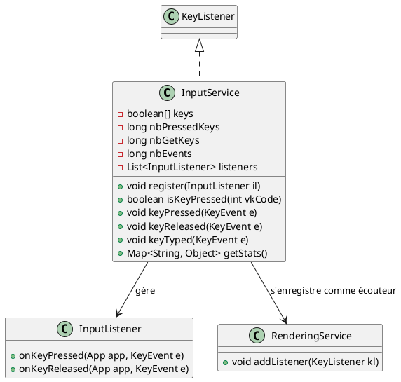

# Fonctionnement détaillé du service **`InputService`**

Le **`InputService`** est conçu pour gérer les interactions clavier dans une application ou un jeu. Il repose sur
l'implémentation de l'interface **`KeyListener`** de Java afin de capturer les événements clavier en temps réel et
fournir une gestion centralisée des entrées. Voici une description détaillée de son fonctionnement et de ses composantes
principales.

---

## 1. Rôles principaux du service

1. **Capture des événements clavier** :
    - Les événements de type **`KeyEvent`**, tels que **`keyPressed`**, **`keyReleased`** et **`keyTyped`**, sont
      interceptés et gérés par l'implémentation de la classe.

2. **Suivi de l'état des touches** :
    - Le tableau `keys` permet de suivre les touches actuellement pressées, en utilisant leurs codes (`vkCode`) comme
      index.

3. **Gestion des auditeurs d'entrée (`InputListeners`)** :
    - Permet l'enregistrement de différents **`InputListener`**, qui recevront des notifications lorsqu'un événement lié
      aux touches se produit.

4. **Statistiques des entrées utilisateur** :
    - Compte divers événements, tels que :
        - Total des pressions de touches (`nbPressedKeys`).
        - Total des touches consultées (`nbGetKeys`).
        - Nombre total d'événements (`nbEvents`).
    - Ces statistiques peuvent être consultées via la méthode **`getStats()`**.

---

## 2. Composants clés

### a) **Propriétés principales**

1. **`boolean[] keys`** :
    - Stocke l’état des 1024 touches possibles (limité par l'API Java).
    - Une valeur `true` indique qu’une touche est pressée ; `false` qu’elle est relâchée.

2. **Liste des **`InputListener`** :
    - Contient les `InputListener` enregistrés, qui seront notifiés des événements de type `keyPressed` ou
      `keyReleased`.

3. **Compteurs statistiques** :
    - **`nbPressedKeys`** : Nombre total de pressions de touches enregistrées.
    - **`nbGetKeys`** : Nombre total de fois où l'état d'une touche a été interrogé via **`isKeyPressed()`**.
    - **`nbEvents`** : Nombre total d'événements (toutes catégories confondues).

---

## 3. Cycle de vie et méthodes

### a) **Initialisation : `init()`**

- Le service est initialisé via **`init(App app, String[] args)`**, où il s'enregistre comme auditeur clavier (via un
  autre service comme **`RenderingService`**).
- **Intégration avec le `RenderingService`** :
    - Le service enregistre ce composant comme auditeur clavier pour capter les événements créés par Java Swing (
      `KeyListener`).

### b) **Gestion des événements clavier**

Les trois événements associés à **`KeyListener`** sont implémentés pour capturer les entrées clavier :

1. **`keyPressed(KeyEvent e)`** :
    - Marque la touche correspondante comme "pressée" dans le tableau `keys`.
    - Incrémente les statistiques : `nbEvents++` et `nbPressedKeys++`.
    - Notifie chaque **`InputListener`** de l'événement grâce à sa méthode **`onKeyPressed(App app, KeyEvent e)`**.

2. **`keyReleased(KeyEvent e)`** :
    - Marque la touche correspondante comme "relâchée" dans le tableau `keys`.
    - Incrémente le compteur `nbEvents++`.
    - Notifie chaque **`InputListener`** via sa méthode **`onKeyReleased(App app, KeyEvent e)`**.

3. **`keyTyped(KeyEvent e)`** :
    - Gère les événements liés aux caractères saisis (peu utilisé ici pour les jeux).
    - Incrémente uniquement le compteur `nbEvents++`.

### c) **Interrogation de l'état des touches : `isKeyPressed(int vkCode)`**

- Permet de vérifier si une touche donnée (`vkCode`) est actuellement pressée.
- Incrémente le compteur `nbGetKeys++`.
- Retourne l'état (`true/false`) de la touche correspondante dans le tableau `keys`.

### d) **Enregistrement des auditeurs : `register(InputListener il)`**

- Permet d'ajouter un nouvel auditeur **`InputListener`** à la liste des auditeurs.
- Ces auditeurs recevront les notifications des événements clavier `keyPressed` et `keyReleased`.

### e) **Statistiques : `getStats()`**

- Retourne une **`Map`** contenant les statistiques suivantes :
    - `service.input.service.counter.events` : Total d'événements captés.
    - `service.input.service.counter.pressed.keys` : Nombre total de pressions enregistrées.
    - `service.input.service.counter.get.keys` : Nombre d'accès à l'état des touches.

### f) **Priorité du service** :

- La méthode **`getPriority()`** renvoie `6`, indiquant que ce service a une priorité plus élevée que certains
  services (comme le moteur physique ou la gestion d'entités).

### g) **Fin de vie du service : `dispose(App app)`**

- Libère les ressources ou permet au service de se déconnecter ; dans ce cas, cette méthode ne contient pas de logique
  spécifique (probablement gérée ailleurs).

---

## 4. Exemple d'utilisation

1. **Enregistrement d'un auditeur personnalisé** :
    - Un objet implémentant **`InputListener`** peut s'enregistrer auprès du **`InputService`** pour recevoir des
      notifications sur les événements clavier.

```java
InputService inputService = new InputService(app);
InputListener customListener = new CustomInputListener();
   inputService.

register(customListener);
```

2. **Manipulation des statistiques** :
    - Après N cycles d'événements :

```java
Map<String, Object> stats = inputService.getStats();
   System.out.

println("Total d'événements : "+stats.get("service.input.service.counter.events"));
```

3. **Vérification de l'état d'une touche** :
    - Dans une boucle de jeu, on peut vérifier l'état des touches :

```java
if(inputService.isKeyPressed(KeyEvent.VK_UP)){
        System.out.

println("La touche directionnelle 'UP' est pressée.");
   }
```

---

## Composants impliqués dans le fonctionnement du **`InputService`**

1. **`App`** :
    - Le service utilise une référence à l'application pour interagir avec d'autres services (comme le *
      *`RenderingService`**) ou échanger des événements.

2. **`RenderingService`** :
    - Client direct du **`InputService`**, car il enregistre ce dernier comme `KeyListener`.

3. **`InputListener`** :
    - Interface qui doit être implémentée par tout auditeur souhaitant capturer les événements clavier. Elle inclut deux
      méthodes : **`onKeyPressed`** et **`onKeyReleased`**.

---

## Diagramme UML simplifié du fonctionnement

Voici une représentation simplifiée, sous forme de diagramme UML avec PlantUML :



---

## Conclusion

Le **`InputService`** agit comme un gestionnaire principal des événements clavier. Avec ses fonctionnalités de suivi des
touches, de gestion des auditeurs et de calcul de statistiques, il centralise tous les aspects liés aux entrées
utilisateur, faisant ainsi partie intégrante du framework pour des applications interactives comme les jeux vidéo.