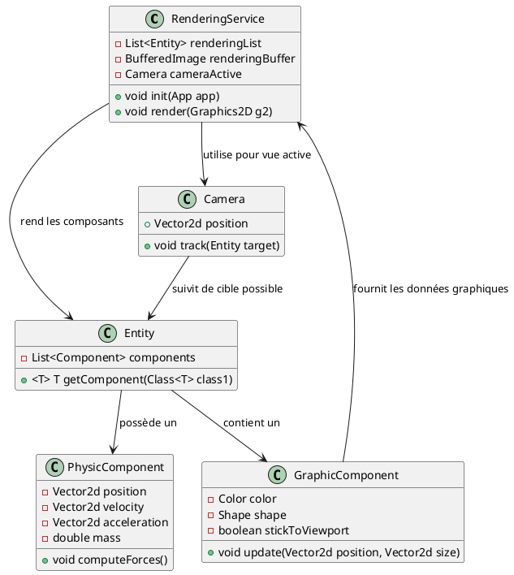

# Le moteur de rendu graphique

Le **`RenderingService`** est conçu pour exécuter les processus graphiques nécessaires dans une application (comme un
jeu) en utilisant un pipeline rendu intégré aux composants Java. Il s'occupe d'afficher les entités à l'écran dans un
contexte fixé par la caméra et influencé par les propriétés associées à leurs composants graphiques. Voici un aperçu
détaillé de son fonctionnement et de ses interactions.

## 1. **Fonctionnalités principales du `RenderingService`**

1. **Rendu graphique des entités** :
    - Il centralise toutes les entités à afficher dans une liste appelée **`renderingList`**.
    - Il récupère les informations graphiques (comme couleur, formes et contours) des composants attachés à chaque
      entité (`GraphicComponent`).

2. **Gestion de la caméra active** :
    - Une instance de **`Camera`** est utilisée pour déterminer la portion de l'espace à afficher. Cela permet un rendu
      focalisé sur une partie spécifique de la scène, comme dans un jeu.

3. **Gestion des buffers de rendu** :
    - Utilise un **`BufferedImage`** comme tampon durant le processus de rendu pour réduire les clignotements à
      l'écran (double buffering).

4. **Affichage via une fenêtre Java** :
    - Assure le rendu final dans une **`JFrame`**, qui agit comme fenêtre principale de l’application.

5. **Interaction avec d'autres services et entités** :
    - Collabore avec des classes comme **`GraphicComponent`** et **`PhysicComponent`**, ainsi qu'avec des services comme
      le **`SceneManagerService`**, pour une gestion fluide des scènes et entités.

## 2. **Cycle de vie et principales méthodes du service**

### a) Initialisation : **`init()`**

- Crée et configure la fenêtre (ou **`JFrame`**) utilisée pour afficher le rendu.
- Prépare le tampon graphique (**`renderingBuffer`**).
- Initialise la caméra active (**`Camera`**) pour définir la perspective initiale.

### b) Collecte des entités pour le rendu

- La **`renderingList`** contient toutes les entités à afficher.
- Chaque entité dans cette liste est analysée pour ses composants graphiques (**`GraphicComponent`**) afin d'extraire
  les informations nécessaires au dessin.

### c) Processus de rendu

Le **`RenderingService`** suit un processus pour afficher les entités :

1. **Création d'un tampon via le `Graphics2D`** :
    - Utilise des paramètres optimisés pour le rendu, comme les **`RenderingHints`** (meilleure qualité
      d’anti-crénelage).
    - Efface le tampon précédent avec une couleur de fond.

2. **Rendu des entités** :
    - Pour chaque entité de la **`renderingList`**, le service :
        - Récupère son **`GraphicComponent`**.
        - Dessine la forme (`Shape`) associée à l'entité, en ajustant la position selon la caméra active.
        - Dessine les contours avec les couleurs définies.

3. **Affichage final** :
    - Le contenu du tampon est affiché dans la fenêtre principale (double buffering), ce qui supprime l'effet de
      clignotement.

### d) Gestion de la caméra

- La caméra active (**`Camera cameraActive`**) :
    - Suit une entité cible ou un point précis dans la scène.
    - Détermine les positions relatives des entités dans l’espace visible.

### e) Interaction avec les entités

- Chaque entité est un conteneur pour divers composants (`GraphicComponent`, `PhysicComponent`, etc.).
- Le service vérifie si une entité possède un **`GraphicComponent`** pour gérér son apparence graphique (couleur, forme,
  visibilité).

## 3. **Interactions du `RenderingService` avec les différentes classes**

### a) Avec **`GraphicComponent`**

- Le **`GraphicComponent`** :
    - Définit les propriétés graphiques d'une entité (couleur, formes, remplissage, etc.).
    - Contient une méthode **`update`**, utilisée pour actualiser les dimensions ou positions visuelles en fonction des
      transformations appliquées à l'entité.
    - Gère un drapeau **`stickToViewport`** indiquant si l'entité doit être toujours visible dans la vue (indépendamment
      de la caméra).

- Interaction :
    - Lors du rendu, le **`RenderingService`** récupère les informations à partir des composants graphiques attachés aux
      entités pour configurer le rendu graphique.

#### Exemple :

``` java
GraphicComponent gc = entity.getComponent(GraphicComponent.class);
if (gc != null) {
    graphics.setColor(gc.getColor());
    graphics.fill(gc.getShape());
    graphics.draw(gc.getShape());
}
```

### b) Avec **`PhysicComponent`**

- Le **`PhysicComponent`** :
    - Définit la position, la vélocité et les dimensions physiques d'une entité.
    - Utilisé pour déterminer où une entité doit être affichée et comment elle interagit avec d'autres éléments de la
      scène.

- Interaction :
    - Lorsque le **`GraphicComponent`** est lié au **`PhysicComponent`**, les propriétés physiques (position, taille)
      influencent le rendu graphique.
    - Notamment, la méthode **`GraphicComponent.update()`** peut être appelée pour adapter la forme (shape) au
      déplacement physique.

### c) Avec **`Entity`**

- Une **`Entity`** est un conteneur générique qui regroupe plusieurs composants modulaires :
    - **`GraphicComponent`** : Pour le rendu visuel.
    - **`PhysicComponent`** : Pour les aspects physiques.
    - **Autres composants** : Peuvent exister pour étendre les fonctionnalités.

- Interaction :
    - Le **`RenderingService`** parcourt la liste des entités pour lesquelles il doit effectuer le rendu graphique.
    - Il extrait les **`GraphicComponent`** de ces entités et effectue les opérations de rendu en conséquence.

## 4. **Diagramme UML en PlantUML**

Voici un diagramme UML montrant les relations entre le **`RenderingService`**, les composants graphiques et physiques,
et les entités.



## 5. **Résumé des interactions clés**

- **Entre `RenderingService` et `GraphicComponent`** : Les composants graphiques définissent comment chaque entité doit
  être affichée.
- **Entre `RenderingService` et `PhysicComponent`** : Les composants physiques influencent la position des entités dans
  l'espace rendu.
- **Entre `RenderingService` et `Camera`** : La caméra contrôle la portée et perspective du rendu.
- **Entre `RenderingService` et `Entity`** : Les entités regroupent les composants nécessaires au rendu graphique et à
  la simulation physique.

## Conclusion

Le **`RenderingService`** agit comme la partie centrale du pipeline graphique en coordonnant la fenêtre d'affichage, la
caméra active et les entités (via leurs composants graphiques). L'interaction avec des éléments physiques (par exemple,
position ou vélocité des entités) et graphiques lui permet de produire un rendu fluide et cohérent. Ce service est
essentiel pour toute application nécessitant une interface graphique riche, notamment les jeux vidéo basés sur un
système d'entités/composants.
