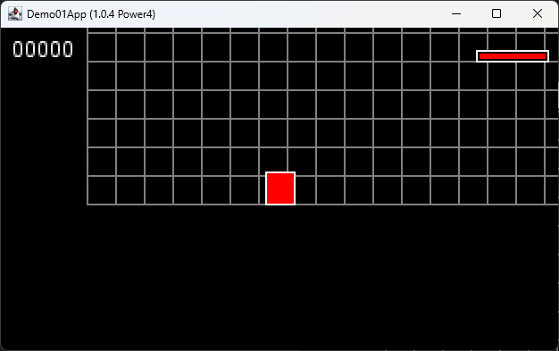

# **Exemples et interactions liés à `Demo01App`**

## **1. Introduction à la classe `Demo01App`**

La classe `Demo01App` représente une implémentation simple d'une application basée sur des services. Elle s'appuie sur
un modèle modulaire où chaque fonctionnalité (gestion de configuration, rendu, gestion des entités, etc.) est
implémentée sous forme de service. Cette structure permet une évolutivité et une gestion séparée des différentes
responsabilités du jeu.

### Points principales :

- Elle initialise et lie divers services comme :
    - **`ConfigurationService`** pour gérer la configuration de l'application.
    - **`EntityManagerService`** pour la gestion des entités.
    - **`PhysicEngineService`** pour la gestion de la physique.
    - **`SceneManagerService`** pour naviguer entre les scènes.
    - **`RenderingService`** pour gérer l'affichage.

- Elle configure également des événements utilisateur grâce à **`InputService`**, qui enregistre des gestionnaires
  d'événements, comme la détection de la touche `Échap` (pour quitter l'application).

La méthode principale **`main(String[] args)`** instancie `Demo01App` et exécute son cycle de vie via **`app.run(args)`
**, lançant ainsi le jeu ou la démonstration.

## **2. Concepts illustrés par `Demo01App`**

1. **Architecture orientée services** :
    - `Demo01App` démontre un exemple clair d'utilisation d'une infrastructure orientée services à partir de la classe
      abstraite **`App`**.
    - Les services sont ajoutés dynamiquement via la méthode `add(Service service)` et ensuite gérés à travers des
      cycles d'invocation.
    - Les priorités d'exécution de chaque service sont encapsulées dans leur propre définition.

2. **Interaction entre services et scènes** :
    - L'application montre comment coordonner différents services pour créer un moteur de jeu robuste et extensible.
    - En particulier, le **`SceneManagerService`** gère la navigation entre scènes, comme l'illustration du `PlayScene`.

3. **Gestion des entrées utilisateur (`InputListener`)** :
    - `Demo01App` est un exemple typique de gestion centralisée des interactions utilisateur dans un cadre basé sur des
      événements.
    - La méthode `onKeyReleased(App app, KeyEvent ke)` illustre spécifiquement la manière de réagir lorsqu'une touche
      est relâchée, en permettant par exemple d'arrêter l'application.

## **3. Relation avec `PlayScene`**

`PlayScene` est une scène de jeu définie pour s'exécuter comme partie intégrante de l'application `Demo01App`. Voici
comment ces deux classes interagissent et se complètent :

### **Initialisation et intégration dans l'application** :

- Lorsque l'application démarre, elle utilise le service **`SceneManagerService`** pour gérer les différentes scènes
  disponibles.
- `PlayScene` est une des scènes configurées, qui est instanciée et enregistrée via ce gestionnaire.

### **Gestion des entrées utilisateur** :

- Tout comme `Demo01App`, `PlayScene` implémente l'interface **`InputListener`**, ce qui lui permet de réagir aux
  saisies clavier pertinentes dans son contexte.
- Par exemple, dans la méthode `onKeyReleased(App app, KeyEvent ke)`, `PlayScene` pourrait, entre autres, déclencher un
  changement de gravité ou ajuster les paramètres de jeu en fonction de la touche relâchée.

### **Cycle de vie des entités** :

- La méthode `create(App app)` de `PlayScene` initialise les entités visibles et/ou fonctionnelles du jeu, telles que le
  joueur, le score, ou les éléments interactifs comme les "bouncing enemies".
- `Demo01App` utilise cette scène pour démontrer une application pratique des services de gestion d'entités et d'
  affichage.

### **Illustration des interactions entre la physique et les entrées** :

- Dans `PlayScene`, les entrées de l'utilisateur sont traduites en modifications des forces appliquées à des entités via
  le moteur physique (géré par le **`PhysicEngineService`**).
- Cela montre comment les systèmes comme l’entrée et la physique peuvent être intégrés dans une infrastructure basée sur
  des services.

## **4. Exemple d'illustration de démo**

L'exemple de démonstration met en lumière les éléments suivants :

1. **Cycle de vie de l'application :**
    - Initialiser, exécuter et désactiver une application.
    - Ajouter des services et gérer leur coordination.

2. **Gestion des scènes :**
    - Passage de scènes (`PlayScene`, d'autres scènes potentielles).
    - Gestion des éléments spécifiques d’une scène, comme des entités interactives ou des layouts.

3. **Réaction aux interactions utilisateur :**
    - Associer des actions aux événements clavier pour naviguer entre les états du jeu.

### **Schéma général pour lancer la démo :**

1. Initialisez `Demo01App` via sa méthode `main`.
2. Le gestionnaire de scènes charge `PlayScene`.
3. L'utilisateur interagit avec le jeu via le clavier (déplacements, annulation d'événements, etc.).
4. Le passage à d'autres scènes ou la fermeture de l'application est géré en capturant des événements spécifiques (
   `Échap`).

## **5. Conclusion**

`Demo01App` est une excellente illustration pour comprendre les principes d'organisation dans une architecture modulaire
de type service. Elle met en avant un exemple concret d’utilisation du framework, combiné avec une scène pratique (
`PlayScene`) pour tester diverses interactions et caractéristiques du moteur de jeu. Vous pouvez l'utiliser comme point
de départ pour étendre les fonctionnalités, comme ajouter d'autres types de scènes, entités ou interactions utilisateur
complexes.
